
# PPZ-Grasshoppers

### 1. Tytuł projektu
**"AppPub – Platforma dostępu do gier arkadowych"**
Prosta i wygodna aplikacja do grania w znane i lubiane gry arkadowe. Nie chlaj tylko graj!

### 2. Skład zespołu
**Klasa 3c:**
- **Jakub Bisikiewicz**  
- **Oliwia Grabowska**  
- **Grzegorz Kornaszewski**

### 3. Cel główny projektu
Celem aplikacji jest umożliwienie amatorskim jak i zaprawionym w bojach graczom nieograniczonego korzystania z prostych, znanych i lubianych gier arkadowych, które z pewnością przypomną użytkownikowi lata świetności.

Grupą docelową są wszyscy ludzie, którzy chcą grać w proste gry arkadowe. Nałóg zastąpi nałóg.

### 4. Zakres funkcjonalności

**Moduły:**
1. **Moduł Główny:**
   - Zestawienie i wybór gier.
   
2. **Moduł Flappy Bird:**
   - Gra Flappy Bird.
   - Modyfikacja poziomu trudności gry.
   
3. **Moduł Snake:**
   - Gra Snake.
   - Modyfikacja poziomu trudności gry.
   
4. **Moduł Pacman:**
   - Gra Pacman.
   - Modyfikacja poziomu trudności gry.

5. **Moduł Knife Hit:**
   - Gra Knife Hit.
   - Modyfikacja poziomu trudności gry.

**MVP:**
- prosta strona główna z listą gier
- co najmniej jedna gra

**Dodatkowe funkcjonalności:**
- Zestawienie najlepszych wyników poszczególnych gier.

### 5. Technologie
**Języki programowania:**
   - Kotlin (Android).

**Narzędzia:**
   - Android Studio (środowisko programistyczne).
   - Git (kontrola wersji).
   - Program do projektowania grafik i interfejsu użytkownika

### 6. Architektura systemu

**Diagram:**
   - Diagram powinien przedstawiać warstwy aplikacji, w tym:
     - Frontend (interfejs użytkownika),
     - Backend (program odpowiedzialny za łączenie UI i logiki programu),
     - Baza danych (plik np. .csv, .txt).

**Opis:**
   - Aplikacja zarządza uruchamianiem gier z poziomu menu. Każda gra ze swojego poziomu zapisuje w bazie danych najlepszy wynik oraz wybrany poziom trudności.
     
### 7. Harmonogram prac dla 4 etapów

**Etap 1: Implementacja modułu głównego i pierwszej gry**  
**Zadania:**
   - Projektowanie menu głównego – *Oliwia Grabowska*
   - Implementacja menu głównego – *Grzegorz Kornaszewski*
   - Projektowanie grafiki pierwszej gry - *Oliwia Grabowska*
   - Implementacja pierwszej gry – *Jakub Bisikiewicz*
   - Połączenie pierwszej gry z menu głównym – *Grzegorz Kornaszewski*
   - Testy funkcjonalne menu głównego i pierwszej gry – *Oliwia Grabowska*

**Etap 2: Implementacja drugiej gry**  
**Zadania:**
   - Projektowanie grafiki drugiej gry - *Oliwia Grabowska*
   - Implementacja drugiej gry – *Grzegorz Kornaszewski*
   - Połączenie drugiej gry z menu głównym – *Jakub Bisikiewicz*
   - Testy funkcjonalne drugiej gry – *Oliwia Grabowska*

**Etap 3: Implementacja trzeciej gry**  
**Zadania:**
   - Projektowanie grafiki trzeciej gry - *Oliwia Grabowska*
   - Implementacja trzeciej gry – *Jakub Bisikiewicz*
   - Połączenie trzeciej gry z menu głównym – *Grzegorz Kornaszewski*
   - Testy funkcjonalne trzeciej gry – *Oliwia Grabowska*

**Etap 4: Implementacja czwartej gry i testy ogólne**  
**Zadania:**
   - Projektowanie grafiki czwartej gry - *Oliwia Grabowska*
   - Implementacja czwartej gry – *Grzegorz Kornaszewski*
   - Połączenie czwartej gry z menu głównym – *Jakub Bisikiewicz*
   - Testy funkcjonalne czwartej gry – *Oliwia Grabowska*
   - Testy funkcjonalne całej aplikacji - *Jakub Bisikiewicz, Oliwia Grabowska, Grzegorz Kornaszewski*

### 8. Kryteria sukcesu
   - Użytkownik może dowolnie wybierać grę i w nią grać
   - Użytkownik może modyfikować poziom trudności gier

### 9. Postęp
**Etap 1**
   - Menu\
     Guzik gry otwiera okno danej gry, liczba w rogu guzika gry to najwyższy wynik w niej osiągnięty. Ikonka zielonego trybika otwiera pole zmiany poziomu trodności gry (widoczne na drugim obrazku). Na dole ekranu wyświetla się losowy żart pozyskiwany z internetu - jest dodana obsługa niemożliwości pozyskania żartu, kliknięcie na to pole załaduje inny losowy żart.\
     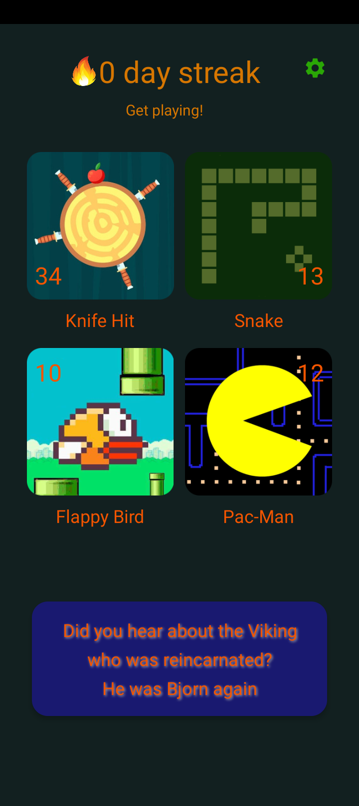
     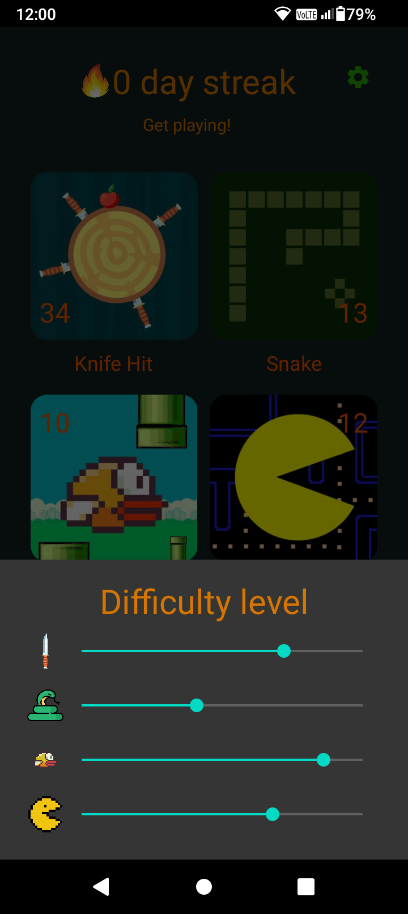
   - Gra Flappy Bird\
     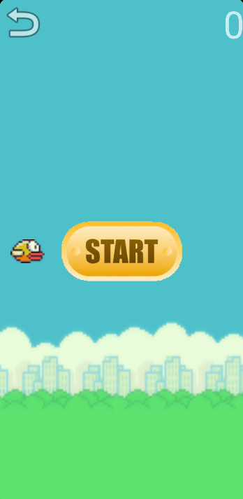
     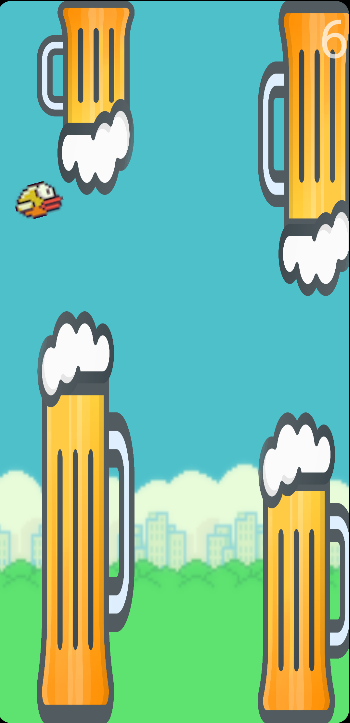
     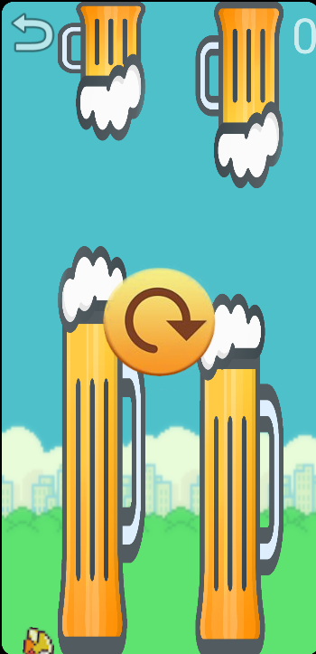

**Etap 2**
   - Gra Knife Hit\
     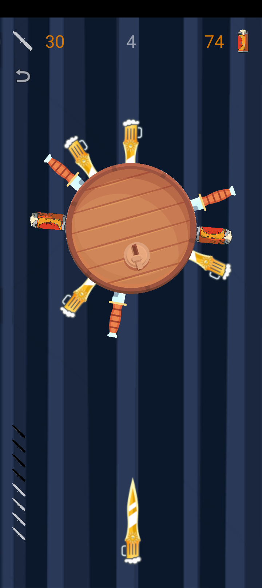
     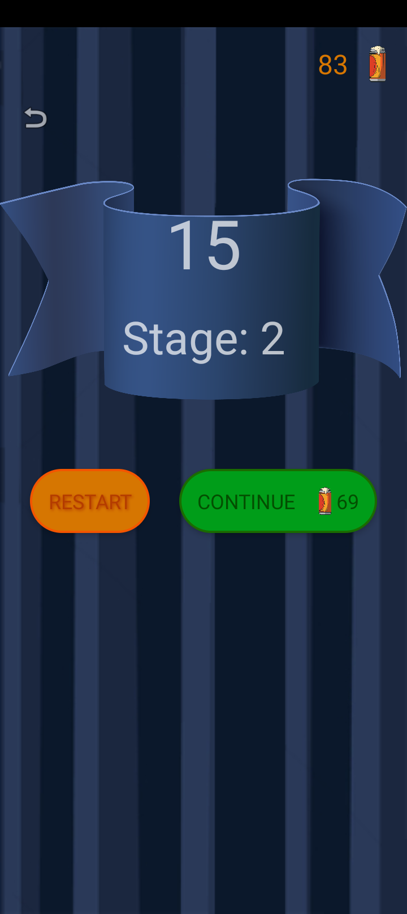
   
   - Poprawki w grze Flappy Bird
     - zmiana jednostek z px na dp (które skalują się do rozmiaru ekranu)
     - dostosowanie wartości wpływających na trudność gry
     - optymalizacja poruszania kolumn, poprzez zastosowanie animacji
     - poprawki drobnych buggów

**Etap 2**
	- Gra Pacman
		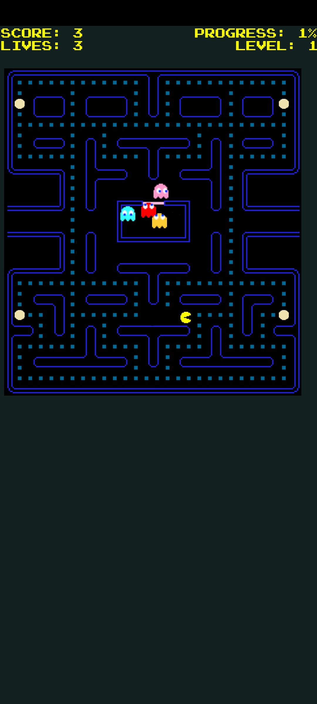
		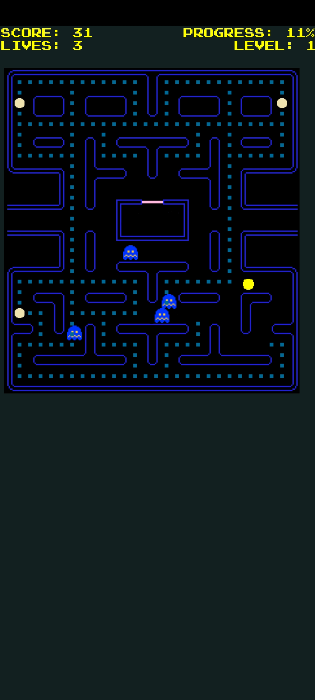
		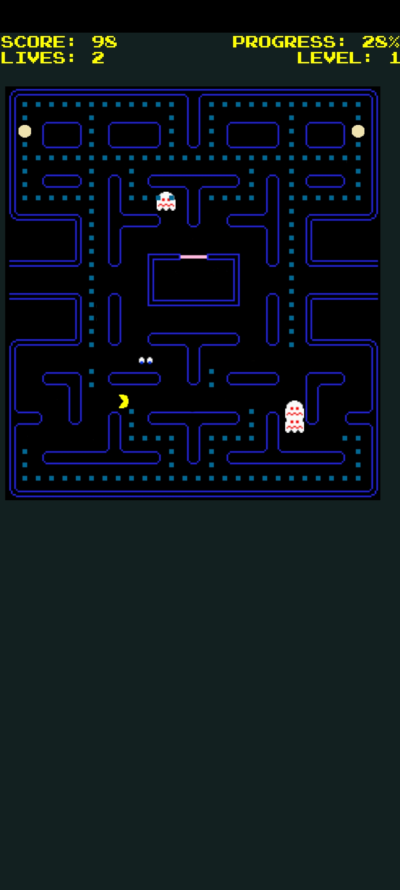
		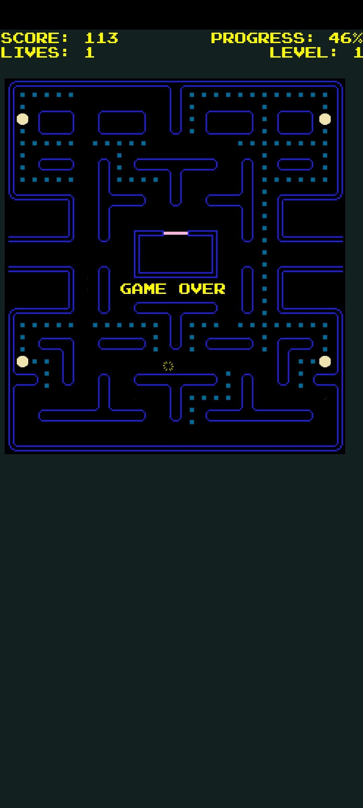
		
<!-- ### 10. Potencjalne ryzyka
   - Problemy z synchronizacją kolejki (mitigacja: regularne testowanie serwera).
   - Awaria systemu powiadomień (mitigacja: backupowe rozwiązanie oparte na SMS-ach).
   - Niska adopcja aplikacji (mitigacja: kampanie promocyjne na WAT). -->
